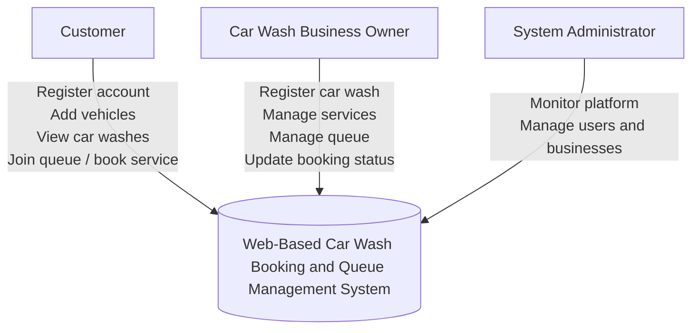
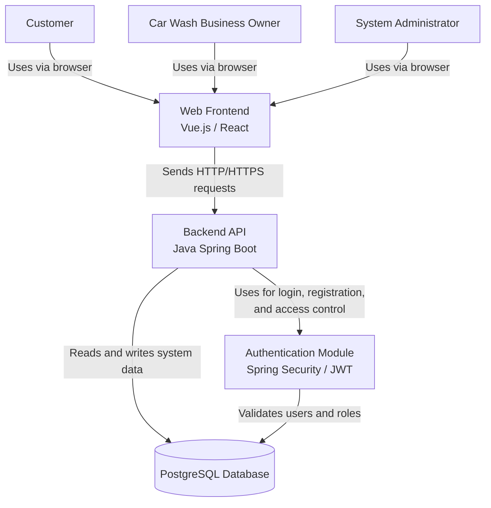
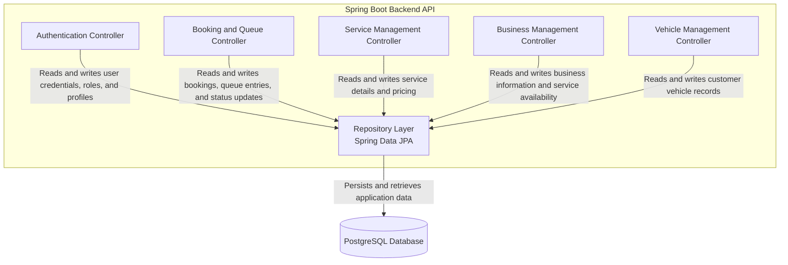

# ARCHITECTURE.md

# System Architecture

## 1. Project Title

**Web-Based Car Wash Booking and Queue Management System**

---

## 2. Domain Description

The domain of this system is **Automotive Service Management**, specifically digital platforms that support the operational management of car wash businesses. This includes customer bookings, queue management, service tracking, and business administration. The system is intended to improve how customers access car wash services and how businesses manage daily service demand.

In many small and medium-sized car wash businesses, operations are still handled manually through walk-in queues and informal service coordination. This creates inefficiencies in customer flow, limited visibility into service availability, and difficulty in managing workload. A digital platform in this domain can improve transparency, coordination, and service delivery.

---

## 3. Problem Statement

Many car wash businesses still rely on manual walk-in queue systems. Customers must physically arrive and wait in line without knowing queue length or estimated waiting times. This results in inefficient service management, unpredictable waiting times, and poor customer experience.

A web-based system can address this problem by allowing customers to view available services, join queues digitally, and monitor booking status. At the same time, car wash businesses can use the platform to manage service flow, update booking progress, and improve operational efficiency.

---

## 4. Individual Scope

This project will design a prototype web-based system that allows customers to register, add vehicles, view available car wash businesses, and join service queues or make bookings. Car wash businesses will manage services, queues, and booking status through an administrative interface.

The project focuses on core booking and queue management features while demonstrating a complete end-to-end architecture using the C4 model. The implementation scope is intentionally limited to remain feasible for an individual semester project, while still showing a realistic modern web system design that can be extended in future.

---

## 5. Planned Technology Stack

### Core Application

- **Backend / API:** Java Spring Boot
- **Database:** PostgreSQL
- **Frontend:** Vue.js or React

### Deployment and DevOps

- **Containerization:** Docker
- **Infrastructure:** AWS
- **CI/CD:** GitHub Actions

### Architecture Modelling

- **Architecture Model:** C4 Model
- **Diagram Syntax:** Mermaid

---

# 6. C4 Architecture Model

## 6.1 System Context Diagram

### System Context Diagram Description

The System Context Diagram presents the system at the highest level and illustrates how external users interact with the platform.

The **Web-Based Car Wash Booking and Queue Management System** serves as a digital platform that connects customers and car wash businesses.

Three primary actors interact with the system:

- **Customer:** Use the system to register accounts, add their vehicles, browse available car wash businesses, view queue availability, and join service queues or make bookings.

- **Car Wash Business Owner:** Register their businesses on the platform and manage operational aspects such as service offerings, pricing, queue management, and booking status updates.

- **System Administrator:** Oversees the platform and manages operational tasks such as monitoring system usage, maintaining user accounts, and managing business registrations.

### System Context Diagram Mermaid Diagram

***This diagram establishes the system boundary and clarifies the external entities interacting with the platform before diving into internal system structure in the next C4 levels.***

## 6.2 Container Diagram

### Container Diagram Description

The **Container Diagram** shows the major technical containers that make up the **Web-Based Car Wash Booking and Queue Management System**.

The **Web Frontend provides** the user interface used by customers, car wash business owners, and administrators through a browser. It is responsible for presenting system data and capturing user actions such as registration, booking, queue joining, and service management.

The **Backend API**, implemented using Java Spring Boot, contains the main business logic of the system. It processes requests from the frontend, handles bookings, manages queues, stores business and vehicle information, and coordinates system behaviour.

The **Authentication Module** is responsible for user registration, login, and role-based access control. It ensures that only authorized users can access the appropriate parts of the system.

The **PostgreSQL Database** stores persistent system data such as users, vehicles, car wash businesses, services, bookings, queue entries, and ratings.

This container structure demonstrates a clear separation of concerns:

- the frontend handles presentation,
- the backend handles application logic,
- the authentication module secures access,
- and the database stores operational data.

### Container Mermaid Diagram

## 6.2 Component Diagram

### Component Diagram Description

The **Component Diagram** focuses on the internal structure of the Spring Boot Backend API and shows how its major functional components interact with the persistence layer.

The **Authentication Controller** manages user registration, login, and access-related processes. It supports the creation and validation of customer, business owner, and administrator accounts.

The **Booking and Queue Controller** is responsible for the system’s core functionality. It handles service bookings, queue joining, queue updates, and booking status changes.

The **Service Management Controller** allows car wash businesses to manage service offerings, pricing, and service-related configurations.

The **Business Management Controller** handles car wash business profiles, registration details, and operational information such as availability.

The **Vehicle Management Controller** manages customer vehicle information, which is required when customers make bookings or join queues.

All these controllers interact with the **Repository Layer**, implemented using **Spring Data JPA**, which abstracts database access and handles data persistence.

The **PostgreSQL Database** stores all persistent system data, including users, vehicles, businesses, services, bookings, and queue records.

This design demonstrates a clear separation of concerns within the backend and supports **maintainability**, **readability**, and **future extension** of the system.

### Component Mermaid Diagram

