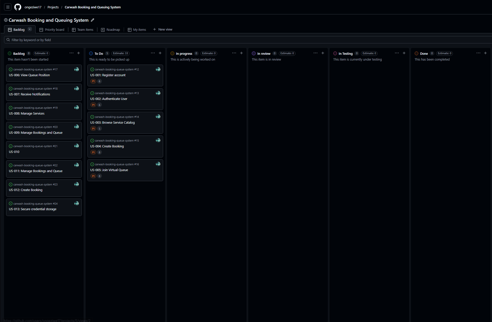

# Kanban Board Explanation

## 1. Overview

A customized GitHub Kanban board was created to manage the development workflow of the **Web-Based Car Wash Booking and Queue Management System**. The board is linked directly to GitHub Issues derived from the user stories created in Assignment 6, allowing requirements, backlog items, and implementation tasks to be tracked in one place.

The purpose of the board is to provide a visual representation of work as it moves through the stages of development. This supports Agile principles such as transparency, continuous progress tracking, prioritization, and incremental delivery.

---

## 2. Board Structure

The Kanban board includes the following workflow columns:

| Column | Purpose |
|--------|---------|
| Backlog | Contains issues that have been identified and prioritized but are not yet selected for immediate work |
| To Do | Contains backlog items selected for upcoming implementation |
| In Progress | Contains issues currently being worked on |
| In Review | Contains completed development work awaiting checking, validation, or review |
| In Testing | Contains issues that are undergoing functional or workflow verification before final completion |
| Done | Contains completed work that has passed through the required workflow stages |

This structure was chosen because it provides a simple but effective way to track issue progression while maintaining visibility into both planned and active work.

### 2.1 Screenshots of the Kanban Board Structure

---

## 3. Customization of the Kanban Board

The board was customized beyond a minimal Kanban setup by using workflow stages that reflect the actual project lifecycle. While a basic board might only include **To Do**, **In Progress**, and **Done**, this project includes additional stages such as **Backlog**, **In Review** and **In Testing**.

These additions improve workflow visibility in the following ways:

- **Backlog** separates unselected work from items currently planned for implementation
- **In Review** ensures work is not marked complete immediately after development, but instead passes through a validation stage
- **In Testing** ensures that all developed work is tested and meets the desired requirement before progressed to being completed
- The distinction between these stages provides a more realistic representation of software engineering practice

This customization makes the board more suitable for an academic project that aims to reflect industry-inspired Agile task management.

---

## 4. Relationship Between Issues and the Board

The Kanban board is directly linked to GitHub Issues created from the user stories and backlog items. Each issue represents a specific piece of system functionality, such as user registration, authentication, browsing the service catalog, booking creation, or joining a virtual queue.

This integration is important because it creates traceability across the project:

- stakeholder concerns informed requirements
- requirements informed user stories
- user stories were converted into GitHub Issues
- GitHub Issues were managed through the Kanban board

This means the board is not separate from the project documentation, but a continuation of it in a practical workflow environment.

---

## 5. How the Board Supports Agile Development

The Kanban board supports Agile development in several ways:

### 5.1 Visibility of Work

The board makes all work items visible, including what is planned, what is currently being worked on, and what has been completed.

### 5.2 Prioritization

Issues linked to the board already reflect priorities from the backlog, allowing the team to focus on high-value items first.

### 5.3 Incremental Delivery

The board supports the development of the MVP in manageable increments, rather than attempting to implement the full system at once.

### 5.4 Workflow Control

By moving items from one column to another, the board captures task progression clearly and helps maintain a structured development flow.

---

## 6. Support for MVP Delivery

The Kanban board directly contributes to MVP delivery by making sure the most important user stories are visible and actionable first. Core features such as:

- Register account
- Authenticate user
- Browse service catalog
- Create booking
- Join virtual queue

were prioritized into the active workflow ahead of less critical features such as notifications, reporting, and additional administrative functionality.

This ensures that development remains aligned with the MVP goal of delivering a functional customer-facing booking and queue experience first.

---

## 7. Practical Benefits of Using GitHub Projects

Using GitHub Projects for this assignment provided several practical advantages:

- It allowed project management to be integrated directly into the same platform used for source control
- It improved traceability between project artefacts and development workflow
- It created a visual representation of Agile planning in action
- It demonstrated how GitHub can be used not only as a code repository, but also as a lightweight project management tool

---

## 8. Conclusion

The customized Kanban board is an effective project management structure for the Web-Based Car Wash Booking and Queue Management System. By linking issues, separating work into workflow stages, and reflecting prioritized MVP development, the board supports both Agile principles and practical implementation tracking.

It provides a clear view of backlog items, active work, review stages, testing and completed tasks, making it a strong fit for managing this project in a structured and iterative way.
