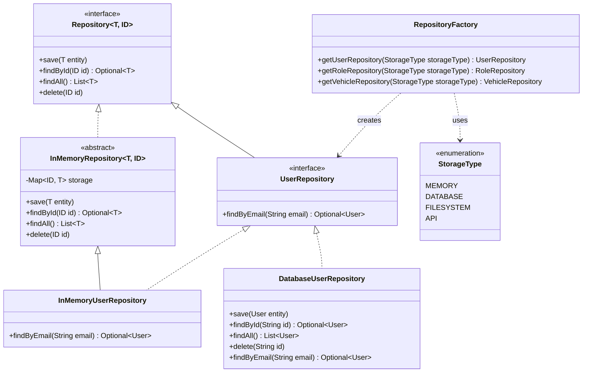

# Repository Class Diagram

The repository layer uses interface-based contracts so business logic stays independent of storage concerns. `InMemory*Repository` classes are the active implementation for now, while `DatabaseUserRepository` is a deliberate stub that demonstrates how a future database backend can plug in by implementing the same `UserRepository` interface. `RepositoryFactory` and `StorageType` centralize backend selection and preserve a stable abstraction boundary for future extensions.
